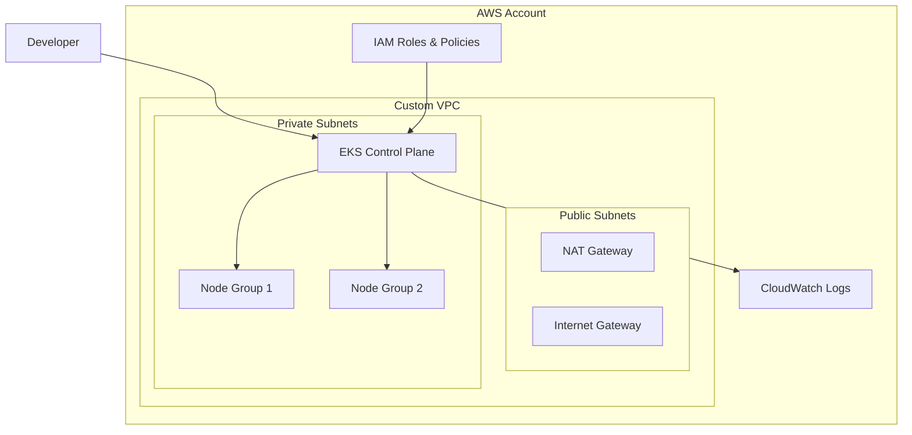

# AWS EKS Cluster with Terraform


A production-ready AWS EKS (Elastic Kubernetes Service) cluster deployed using Terraform Infrastructure as Code (IaC). This project creates a complete Kubernetes environment with custom VPC, managed node groups, and automated access management.

## 🏗️ Architecture



## ✨ Features

- **🔧 Infrastructure as Code**: Complete infrastructure defined in Terraform
- **🔒 Security First**: Private subnets, IAM roles, and RBAC access control
- **💰 Cost Optimized**: Spot instances and right-sized resources
- **🚀 Production Ready**: High availability across multiple AZs
- **🔄 Automated Setup**: One-command cluster provisioning
- **🎯 Modular Design**: Reusable Terraform modules

## 🛠️ Technologies Used

| Technology | Purpose |
|------------|---------|
| **AWS EKS** | Managed Kubernetes service |
| **Terraform** | Infrastructure as Code |
| **AWS VPC** | Network isolation and security |
| **EC2 (Spot)** | Cost-effective compute resources |
| **IAM** | Access management and security |

## 📋 Prerequisites

Before you begin, ensure you have:

- [ ] AWS CLI configured with appropriate permissions
- [ ] Terraform >= 1.0 installed
- [ ] kubectl installed
- [ ] Valid AWS credentials with EKS permissions

### Required AWS Permissions

```json
{
  "Version": "2012-10-17",
  "Statement": [
    {
      "Effect": "Allow",
      "Action": [
        "eks:*",
        "ec2:*",
        "iam:*",
      ],
      "Resource": "*"
    }
  ]
}
```

## 🚀 Quick Start

### 1. Clone the Repository

```bash
git clone https://github.com/rks007/terraform-eks.git
cd eks-terraform-cluster
```

### 2. Configure Variables

Create a `terraform.tfvars` file:

```hcl
# terraform.tfvars
aws_region = "us-west-2"
cluster_name = "my-eks-cluster"
environment = "dev"
node_instance_types = ["t3.medium"]
node_capacity_type = "SPOT"
```

### 3. Deploy Infrastructure

```bash
# Initialize Terraform
terraform init

# Plan the deployment
terraform plan

# Apply the configuration
terraform apply -auto-approve
```

### 4. Verify Deployment

```bash
# Do this
aws eks update-kubeconfig --region <your-region> --name <cluster-name>

# Test kubectl access
kubectl get nodes
kubectl get pods -A
```

## 📁 Project Structure

```
eks-terraform-cluster/
├── README.md                 # This file
├── main.tf                   # Main Terraform configuration
├── variables.tf              # Input variables
├── outputs.tf                # Output values
├── locals.tf                 # Local values
├── terraform.tfvars.example  # Example variables
├── modules/
│   ├── vpc/                  # Custom VPC module
│   │   ├── main.tf
│   │   ├── variables.tf
│   │   └── outputs.tf
│   └── eks/                  # EKS module configuration
│       ├── main.tf
│       ├── variables.tf
│       └── outputs.tf
├── examples/
│   └── sample-app/           # Sample Kubernetes application
│       ├── deployment.yaml
│       └── service.yaml
└── docs/
    ├── ARCHITECTURE.md       # Detailed architecture docs
    └── TROUBLESHOOTING.md    # Common issues and solutions
```

## ⚙️ Configuration Options

### Cluster Configuration

```hcl
# EKS Cluster Settings
cluster_version = "1.30"
endpoint_public_access = true
endpoint_private_access = true

# Node Group Settings
min_size = 2
max_size = 10
desired_size = 3
instance_types = ["t3.medium", "t3.large"]
capacity_type = "SPOT"  # or "ON_DEMAND"
```

### Networking Configuration

```hcl
# VPC Settings
vpc_cidr = "10.0.0.0/16"
private_subnets = ["10.0.1.0/24", "10.0.2.0/24", "10.0.3.0/24"]
public_subnets = ["10.0.101.0/24", "10.0.102.0/24", "10.0.103.0/24"]
enable_nat_gateway = true
single_nat_gateway = false  # Multi-AZ NAT for HA
```

## 🔐 Security Features

- **Private Node Groups**: Worker nodes in private subnets
- **IAM Integration**: AWS IAM for authentication
- **RBAC**: Kubernetes Role-Based Access Control
- **Network Policies**: Pod-to-pod communication control
- **Encryption**: EBS volume encryption enabled
- **Security Groups**: Restrictive ingress/egress rules

## 💡 Cost Optimization

| Feature | Savings |
|---------|---------|
| Spot Instances | Up to 90% |
| Right-sizing | 20-30% |
| Single NAT Gateway (dev) | $45/month |
| Cluster Autoscaler | 10-50% |

## 🚨 Troubleshooting

### Common Issues

**Issue**: `Access denied` when running kubectl
```bash
# Solution: Update kubeconfig
aws eks update-kubeconfig --region us-west-2 --name my-eks-cluster
```

**Issue**: Nodes not joining cluster
```bash
# Check node group status
aws eks describe-nodegroup --cluster-name my-eks-cluster --nodegroup-name workers
```

**Issue**: Terraform state lock
```bash
# Force unlock (use carefully)
terraform force-unlock LOCK_ID
```

## 🧪 Testing

### Validate Cluster Health

```bash
# Check cluster status
kubectl get nodes -o wide

# Verify system pods
kubectl get pods -n kube-system

# Test pod scheduling
kubectl run test-pod --image=nginx --restart=Never
kubectl get pod test-pod
kubectl delete pod test-pod
```

### Deploy Sample Application

```bash
kubectl apply -f examples/sample-app/
kubectl get pods -l app=sample-app
kubectl get service sample-app
```

## 🤝 Contributing

1. Fork the repository
2. Create a feature branch (`git checkout -b feature/amazing-feature`)
3. Commit your changes (`git commit -m 'Add amazing feature'`)
4. Push to the branch (`git push origin feature/amazing-feature`)
5. Open a Pull Request

## 📜 License

This project is licensed under the MIT License - see the [LICENSE](LICENSE) file for details.

## 👨‍💻 Author

**Your Name**
- GitHub: [@yourusername](https://github.com/yourusername)
- LinkedIn: [your-profile](https://linkedin.com/in/your-profile)
- Email: your.email@example.com

## 🙏 Acknowledgments

- [Terraform AWS EKS Module](https://github.com/terraform-aws-modules/terraform-aws-eks)
- [AWS EKS Best Practices](https://aws.github.io/aws-eks-best-practices/)
- [Kubernetes Documentation](https://kubernetes.io/docs/)

---

⭐ **Star this repository if it helped you!** ⭐


------------------------------------------------------------------------------------------------------------------
after creating the eks cluster through terraform

run this command then you can see your nodes running kubectl get nodes

aws eks update-kubeconfig --region <your-region> --name <cluster-name>
